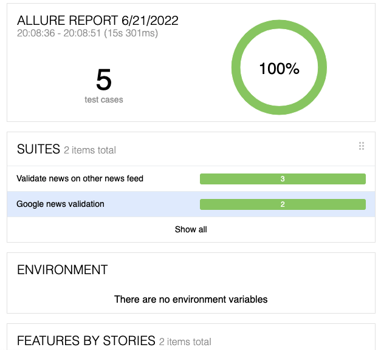

# Description

Imagine you are building news validation site to prevent fake news. You first story is to
confirm that news from https://www.theguardian.com/tone/news is valid. The product
owner wants to start with a simple confirmation by checking other sources to confirm a
news article is valid. For the first news article on https://www.theguardian.com/tone/news
your task is to search google/other resources for similar information to confirm that the
article is valid.

### What to use

Using Cucumber, Selenium, and Java, create a few scenarios to achieve this functionality.

## Framework Stack

> ***Java Programming Language***
> 
> ***Selenium Webdriver***: a library for web automation
> 
> ***Selenide***: a wrapper of Selenium WebDriver
> 
> ***RestAssured***: Used for testing and validating REST services
> 
> ***JUnit***: Unit tesitng framework


## Clone project from any folder

Clone project to any folder **without spaces/not ascii symbols on it**, eg: `c:\Users\name`

* HTTPS:
    ```bash
        git clone https://github.com/willokans/JPMC-news-framework.git
    ```
Git should create a folder called `JPMC [news-framework]` with all the files in it.

## Run Framework

### 1. Via IntelliJ Idea runner
To run any test from IntelliJ, all you need to do is right click on the feature file
or the Scenario and select:
```
Run 'Feature: X...'
OR
Run 'Scenario: X...'
```

### 2. Via Maven cmd
```
mvn clean verify -Dcucumber.options" --tags @tag_name_for_test --glue com.jpmc.steps
```

You can also add **-Dselenide=headless=true** to run browser in headless mode

To run on a different browsers other than chrome, pass below option to you mvn cmd line
```
-Dselenide.browser="browser name"
```

### For launching test through Java Class runner

Find the following java class in class **TestRunner.java**
```java
@RunWith(Cucumber.class)
@CucumberOptions(
        features = {"src/test/resources/features"},
        glue = {"com.jpmc.steps"},
        monochrome = false,
        plugin = {"pretty",
                "html:target/cucumber-html-report",
                "json:target/cucumber-reports/cucumber.json",
                "junit:tartget/cucumber-reports/cucumber.xml",
                "io.qameta.allure.cucumber7jvm.AllureCucumber7Jvm"}

)
public class TestRunner {}
```
### 3. Allure reports

Implementing allure reports allow for a flexible, lightweight test reporting tool.
It provides a clear graphical report.
All data gathered from you target folder after running the test via Maven is used to generate a report.

Excecute this line to generate report
```
allure serve allure-results
```

